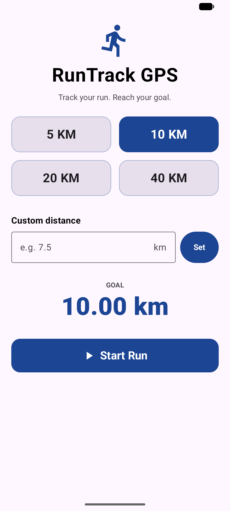

<div align="center">

# 🏃 RunTrack GPS — Android

[](https://www.android.com)
[](https://kotlinlang.org)
[](https://developer.android.com/jetpack/compose)
[](https://developers.google.com/maps)

**A clean, lightweight native Android running app — track your run by GPS, watch your route draw live, and reach your distance goal with voice feedback.**

</div>

## Screenshot

<div align="center">



</div>

## About

The native **Android** port of [RunTrack GPS](../../iOS/runningapp). Built entirely with
**Kotlin + Jetpack Compose** and an **MVVM** architecture, it mirrors the iOS app feature-for-feature:
pick a preset or custom distance goal, start running, and the app tracks distance, pace, and time in
real time while drawing your route on a live Google Map — even with the screen locked.

### Key Features

- 🎯 **Goals** — preset 5 / 10 / 20 / 40 km, or a custom distance
- 🛰️ **Real-time GPS tracking** with noise filtering (rejects poor accuracy, jitter, unrealistic jumps)
- 🗺️ **Live route map** (Google Maps Compose) with start marker, my-location and follow-me camera
- ⏱️ **Distance, pace & time** updating live, with a big glanceable readout
- 🗣️ **Voice commands** — "start / pause / resume / stop" (Android `SpeechRecognizer`)
- 🔊 **Voice feedback** — spoken milestones at each km, halfway, 90%, and goal (`TextToSpeech`)
- 🌙 **Background tracking** — a foreground service keeps GPS + audio alive when the screen is locked
- 📊 **On-device history** — every run saved locally (distance, time, pace, date)
- 🎨 Material 3, automatic dark mode, large typography, large touch targets

## Tech Stack

| Layer | Technology |
|-------|-----------|
| Language | Kotlin 2.1 |
| UI | Jetpack Compose + Material 3 (minSdk 26 / Android 8) |
| Architecture | MVVM (single coordinating `RunViewModel`) |
| Location | FusedLocationProvider + foreground service (background updates, GPS filtering) |
| Maps | Google Maps Compose (`maps-compose`) |
| Voice input | `android.speech.SpeechRecognizer` |
| Voice output | `android.speech.tts.TextToSpeech` |
| Persistence | SharedPreferences + kotlinx.serialization (local, on-device) |
| Build | Gradle (Kotlin DSL), AGP 8.10 |

## Architecture

```
┌──────────────────────── Compose Screens ───────────────────────┐
│   HomeScreen   RunScreen   CompletionScreen   HistoryScreen     │
└───────────────────────────────┬─────────────────────────────────┘
                                │ observe Compose state
                       ┌────────▼─────────┐
                       │   RunViewModel    │   ← MVVM coordinator
                       │  (state + actions)│
                       └──┬────┬────┬───┬──┘
            ┌─────────────┘    │    │   └─────────────┐
   ┌────────▼───────┐ ┌────────▼─┐ ┌▼──────────────┐ ┌▼──────────────┐
   │ LocationManager│ │RunTimer  │ │VoiceCommand   │ │SpeechFeedback │
   │ Fused + filter │ │Manager   │ │Manager (STT)  │ │ (TTS)         │
   └───────┬────────┘ └──────────┘ └───────────────┘ └───────────────┘
           │ route + distance
   ┌───────▼────────┐  ┌────────────────┐
   │   RouteMap      │  │   RunStore      │
   │ (Google Maps)   │  │ SharedPreferences│
   └────────────────┘  └────────────────┘
```

`RunViewModel` is the single source of truth: it owns the four managers, collects their `StateFlow`s,
recomputes pace, fires de-duplicated milestone announcements, detects goal completion, and drives
navigation. Screens are thin and read only from the view model.

## Getting Started

### Prerequisites

- **Android Studio** (Ladybug or newer) with the Android SDK (compileSdk 36)
- A **Google Maps API key** — see [PLAY_STORE_SETUP.md](PLAY_STORE_SETUP.md#1-google-maps-api-key)
- An Android phone (Android 8+) with **USB debugging** on, or an emulator with Google Play services

### Configure

Add your Maps key to `local.properties` (gitignored — never commit it):

```properties
sdk.dir=/Users/you/Library/Android/sdk
MAPS_API_KEY=AIza...your_key...
```

### Build & run

```bash
# Debug APK
./gradlew :app:assembleDebug

# Install on a connected device / running emulator
./gradlew :app:installDebug
# or
adb install -r app/build/outputs/apk/debug/app-debug.apk
```

Grant **Location**, **Microphone**, and **Notifications** when prompted. For full background tracking,
choose **Allow all the time** for location.

## Permissions & background

The app requests `ACCESS_FINE/COARSE_LOCATION` (+ `ACCESS_BACKGROUND_LOCATION` for screen-locked
tracking), `RECORD_AUDIO` (voice commands), and `POST_NOTIFICATIONS` (the foreground-service
notification). A `FOREGROUND_SERVICE_LOCATION` service keeps GPS, the timer, and spoken feedback
running in the background. All run data stays **on the device** — nothing is uploaded.

## Releasing to Google Play

See [PLAY_STORE_SETUP.md](PLAY_STORE_SETUP.md) for the full, click-by-click guide: signing keystore,
building the release **App Bundle (.aab)**, and configuring the Play Console listing, content rating,
and data-safety form.

## License

Released under the MIT License.

## Developed By

**Tertiary Infotech Academy Pte. Ltd.**
